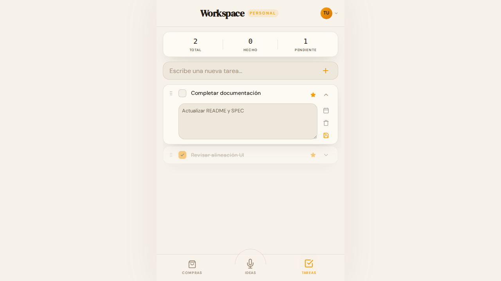
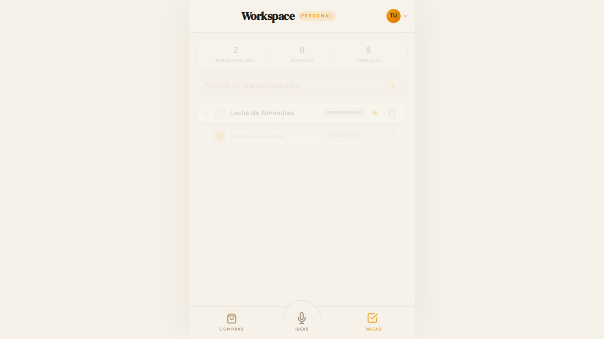
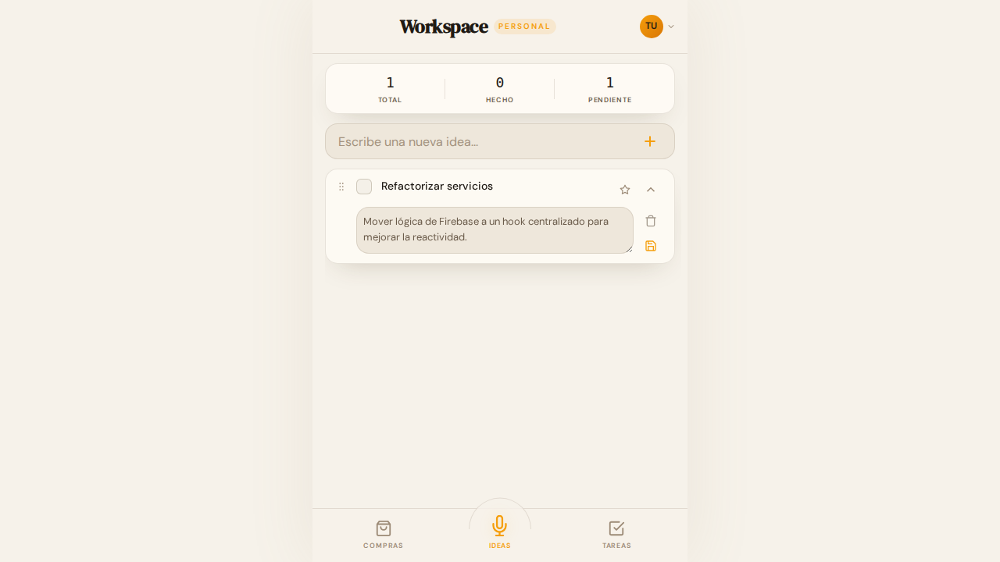

# Workspace Personal

A premium, mobile-first productivity Single Page Application (SPA) designed for personal organization. Built with a focus on simplicity, performance, and a refined dark aesthetic.

## 📸 Preview

<div align="center">
  
  
  
</div>

## 🚀 Overview

**Workspace Personal** is a centralized tool to manage your daily life across three core modules:
- **🛒 Compras (Shopping List):** Organized by categories with smart sorting.
- **💡 Ideas (Notes):** Fast capture with search, archival, and expandable notes.
- **✅ Tareas (Tasks):** Priority-based management with due dates and real-time sync.

## ✨ Key Features

- **Mobile-First Design:** Optimized for mobile browsers with a full-viewport, premium glassmorphism aesthetic.
- **🎙️ Intelligent Voice Capture:** Long-press the Microphone icon in the navigation bar to capture thoughts. Powered by OpenRouter LLM for smart categorization into Compras, Ideas, or Tareas.
- **📦 Automated Task Archiving:** Completed tasks are automatically archived daily at 3 AM to keep your workspace clean.
- **Real-Time Sync:** Powered by Firebase Firestore for seamless multi-device updates.
- **Secure by Design:** Built-in XSS protection, input validation (DataService), and secure credential management via Vite environment variables.
- **Reactive State:** Centralized `appState` for instant UI feedback and optimistic updates.
- **Advanced UI:** Inline title editing, sortable lists, and multi-select bulk actions.
- **Typography:** DM Serif Display & DM Sans pairing.

## ⚡ Performance Optimizations
... (rest of the section) ...

## 🛠️ Tech Stack

- **Tooling:** [Vite](https://vitejs.dev/)
- **Core:** Vanilla JavaScript (ES6+), HTML5, CSS3 (Modular ITCSS-like structure)
- **Backend:** Firebase (Auth & Firestore)
- **AI Integration:** OpenRouter (for Voice Capture processing)
- **Persistence:** Firestore + local caching with user-specific keys.

## 📦 Project Structure

```text
├── src/
│   ├── app.js           # App Entry & Auth Listener
│   ├── store.js         # Centralized Reactive State
│   ├── firebase.js      # Firebase SDK Initialization
│   ├── services/        # Business Logic (Sync, Voice, Archiver)
│   ├── styles/          # Modular CSS (Variables, Layout, Components)
│   ├── ui/              # UI Modules & Sections (Tabs, Modals, Toasts)
│   └── utils/           # Helper functions (Formatting, Storage)
├── .env                 # API Keys (Git ignored)
├── index.html           # Main Entry point
├── SPEC.md              # Technical Specification
├── GEMINI.md            # Agent Context & Standards
└── AGENTS.md            # Developer Quick Start
```

## ⚙️ Getting Started

### Prerequisites
- Node.js (v18+)
- pnpm (Recommended)

### Installation & Config
1. Clone the repository.
2. Install dependencies: `pnpm install`.
3. Create a `.env` file in the root:
   ```env
   VITE_FIREBASE_API_KEY=your_key
   VITE_FIREBASE_AUTH_DOMAIN=your_project.firebaseapp.com
   VITE_FIREBASE_PROJECT_ID=your_project
   ...
   ```
4. Start dev server: `pnpm dev`.

### Building for Production
To create an optimized production build:
```bash
pnpm build
```
Preview the build locally:
```bash
pnpm preview
```

## 📜 Specification
For deep technical details on the UI/UX, state management, and functional requirements, see [SPEC.md](./SPEC.md).

---
*Built with precision as part of the Workspace project.*
