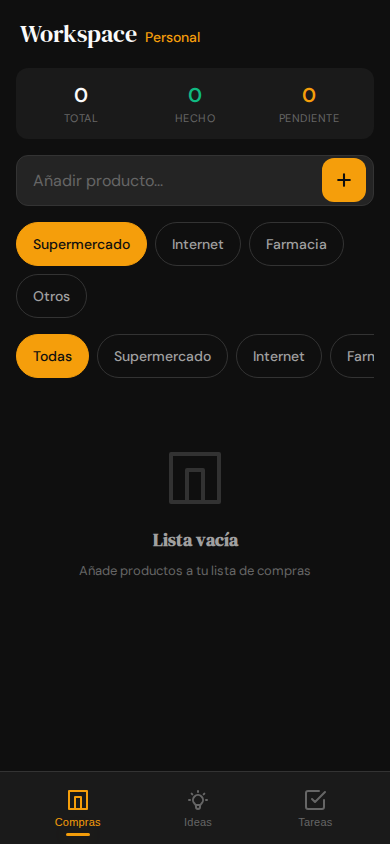

# Workspace Personal

A premium, mobile-first productivity Single Page Application (SPA) designed for personal organization. Built with a focus on simplicity, performance, and a refined dark aesthetic.



## 🚀 Overview

**Workspace Personal** is a centralized tool to manage your daily life across three core modules:
- **🛒 Compras (Shopping List):** Organized by categories with smart sorting.
- **💡 Ideas (Notes):** Fast capture with search, archival, and expandable notes.
- **✅ Tareas (Tasks):** Priority-based management with due dates and real-time sync.

## ✨ Key Features

- **Mobile-First Design:** Optimized for mobile browsers with a full-viewport, premium glassmorphism aesthetic.
- **Real-Time Sync:** Powered by Firebase Firestore for seamless multi-device updates.
- **Secure by Design:** Built-in XSS protection, input validation, and secure credential management.
- **Reactive State:** Centralized `appState` for instant UI feedback.
- **Typography:** DM Serif Display & DM Sans pairing.

## 🛠️ Tech Stack

- **Tooling:** [Vite](https://vitejs.dev/)
- **Core:** Vanilla JavaScript (ES6+), HTML5, CSS3 (Modular)
- **Backend:** Firebase (Auth & Firestore)
- **Persistence:** Firestore + local caching.

## 📦 Project Structure

```text
├── src/
│   ├── app.js           # App Entry & Auth
│   ├── store.js         # Reactive State
│   ├── firebase.js      # Firebase Initialization
│   ├── services/        # Data & Sync Logic
│   ├── styles/          # Modular CSS System
│   └── ui/              # Components & Sections
├── .env                 # API Keys (Git ignored)
├── index.html           # Entry point
└── SPEC.md              # Technical Spec
```

## ⚙️ Getting Started

### Prerequisites
- Node.js (v18+)
- pnpm (Recommended)

### Installation & Config
1. Clone the repository.
2. Install dependencies: `pnpm install`.
3. Create a `.env` file in the root:
   ```env
   VITE_FIREBASE_API_KEY=your_key
   VITE_FIREBASE_AUTH_DOMAIN=your_project.firebaseapp.com
   VITE_FIREBASE_PROJECT_ID=your_project
   ...
   ```
4. Start dev server: `pnpm dev`.

### Building for Production
To create an optimized production build:
```bash
pnpm build
```
Preview the build locally:
```bash
pnpm preview
```

## 📜 Specification
For deep technical details on the UI/UX, state management, and functional requirements, see [SPEC.md](./SPEC.md).

---
*Built with precision as part of the Workspace project.*
